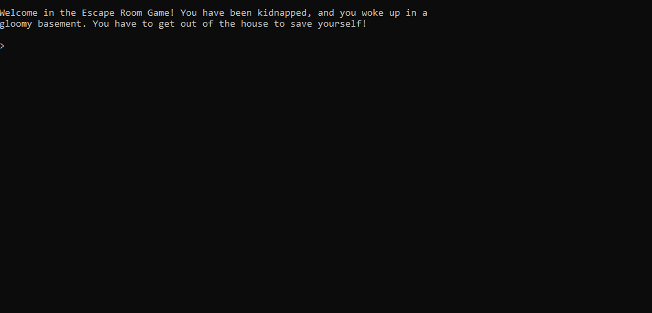

    

<h1 align="center">ScalaQuest</h1>

ScalaQuest is an exam project for PPS and LSS courses in UNIBO, made by
[Riccardo Maldini](https://www.riccardomaldini.it),
[Filippo Nardini](https://github.com/lippo97),
[Jacopo Corina](https://github.com/corinz97),
[Francesco Gorini](https://github.com/francescogorini),
[Thomas Angelini](https://github.com/ThomasAngeliniUnibo).

## The idea behind the project

The basic idea is to create a framework for the implementation of games of the
[Interactive Fiction](https://en.wikipedia.org/wiki/Interactive_fiction) genre,
in which the player can use text commands to influence the environment and
continue in the game (e.g. [Zork](https://en.wikipedia.org/wiki/Zork)).

## Official documentation

The official documentation of the project consists in:
- [PPS Report](https://scalaquest.github.io/Reports/reports/pps.html) and [LSS Report](https://scalaquest.github.io/Reports/reports/lss.html). The previous links shows a web version of reports, auto-generated from the [report sources](https://github.com/scalaquest/reports). You can also consult them in a [PDF LaTeX](https://github.com/scalaquest/reports/releases/latest) format.
- the official Scaladoc of the [Core](https://scalaquest.github.io/PPS-19-ScalaQuest/scaladoc/core/index.html) and [CLI](https://scalaquest.github.io/PPS-19-ScalaQuest/scaladoc/cli/index.html) modules;
- the official Coverage reports for the [Core](https://scalaquest.github.io/PPS-19-ScalaQuest/coverage/core/index.html) and [CLI](https://scalaquest.github.io/PPS-19-ScalaQuest/coverage/cli/index.html) modules.

## How to use it?

You can use `core` or `cli` modules by downloading them from the [release page](https://github.com/scalaquest/PPS-19-ScalaQuest/releases/latest), and including the jar files as your project dependencies.

The `cli` module includes `core` as an internal dependency: it is sufficient to start programming your game, if you want to build it as a CLI application.

Use the `core` module only if you want to define your personal user interface, different from a simple CLI.

You can directly play the examples from your terminal: download the [latest EscapeRoom or PokeQuest release](https://github.com/scalaquest/PPS-19-ScalaQuest/releases/latest), unzip the 
choosen game and run it from your terminal (`bin/gamename` for Unix devices, `bin/gamename.bat` for Windows ones).