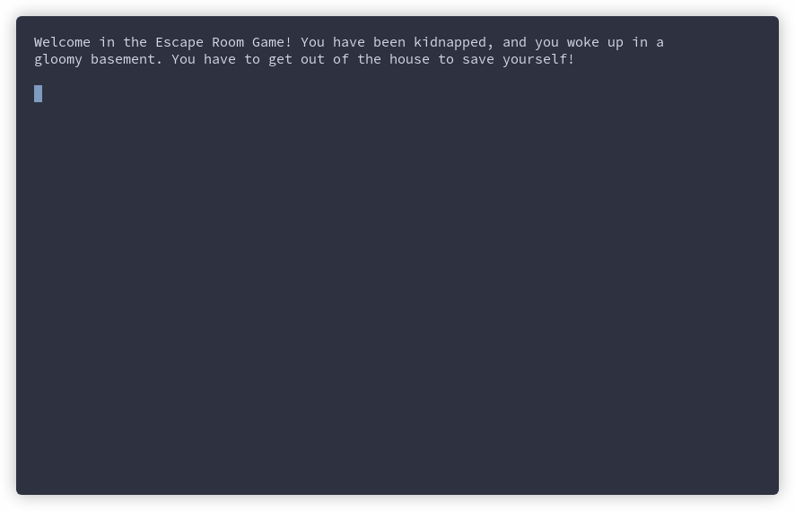

## The idea behind the project

The basic idea is to create a framework for the implementation of games of the
[Interactive Fiction](https://en.wikipedia.org/wiki/Interactive_fiction) genre,
in which the player can use text commands to influence the environment and
continue in the game (e.g. [Zork](https://en.wikipedia.org/wiki/Zork)).

## Official documentation

The official documentation of the project consists in:
- [PPS Report](https://scalaquest.github.io/Reports/reports/pps.html) and
  [LSS Report](https://scalaquest.github.io/Reports/reports/lss.html). The
  previous links shows a web version of reports, auto-generated from the
  [report sources](https://github.com/scalaquest/reports). You can also
  consult them in a [LaTeX PDF](https://github.com/scalaquest/reports/releases/latest)
  format;
- An [appendix document](https://scalaquest.github.io/Reports/reports/appendix.html)
  including the Scrum Overview, a summary of what has been done in each Scrum,
  with an index of linked issues and PR for each one. The document has been
  incrementally updated at each Scrum Review meeting. The document is also
  available as a [LaTeX PDF](https://github.com/scalaquest/reports/releases/latest);
- The [project backlog](https://github.com/orgs/scalaquest/projects/1),
  publicly available as a GitHub Projects board;
- The official Scaladoc of the [Core](https://scalaquest.github.io/PPS-19-ScalaQuest/scaladoc/core/index.html)
  and [CLI](https://scalaquest.github.io/PPS-19-ScalaQuest/scaladoc/cli/index.html) modules;
- The official Coverage reports for the [Core](https://scalaquest.github.io/PPS-19-ScalaQuest/coverage/core/index.html)
  and [CLI](https://scalaquest.github.io/PPS-19-ScalaQuest/coverage/cli/index.html) modules.

## How to use the game creation framework?

You can use `core` or `cli` libraries by downloading them from the
[release page](https://github.com/scalaquest/PPS-19-ScalaQuest/releases/latest),
and including them as project dependencies.

Including the `cli` jar is sufficient to start programming your CLI game, as the
module includes `core` as an internal dependency.

Importing the `core` solely is recommended only if you want to define your
personal game interface, different from the standard CLI (e.g. a web interface).

## How to play the example games?

ScalaQuest includes some examples that shows how to correctly use the library.
You can use them as your game template, if you don't want to start from scratch.
Download the [latest EscapeRoom or PokeQuest releases](https://github.com/scalaquest/PPS-19-ScalaQuest/releases/latest),
unzip the choosen game and run it from your terminal (`bin/gamename` for Unix
devices, `bin/gamename.bat` for Windows ones).
